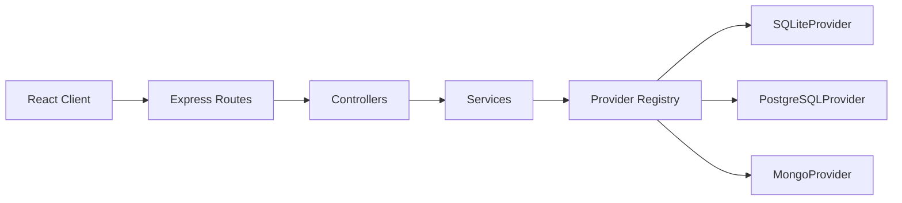

# Architecture

The application is split into a React client and an Express API server. The backend follows the requested layered architecture:

```text
Routes -> Controllers -> Services -> Providers
```



## Major Modules

- Client app shell: global layout and navigation structure.
- Connection manager: future UI and state for saved database connections.
- Database explorer: future tree view for tables, views, indexes, and collections.
- Data workspace: future record browsing, filtering, sorting, and editing.
- Query workspace: future SQL and Mongo query execution surfaces.
- API routes: request entry points grouped by capability.
- Controllers: HTTP request and response translation.
- Services: application workflows and business rules.
- Providers: database-specific implementations behind a shared contract.

## Provider Model

All database engines conform to `DatabaseProvider`. Providers expose metadata and will later implement:

- `connect`
- `disconnect`
- `testConnection`
- `inspectSchema`
- `query`

Adding another database should require:

1. Creating a provider class that extends `DatabaseProvider`.
2. Registering it in `providerRegistry`.
3. Adding feature-specific methods only when the shared service layer needs them.

This keeps database-specific behavior out of controllers and UI code.
